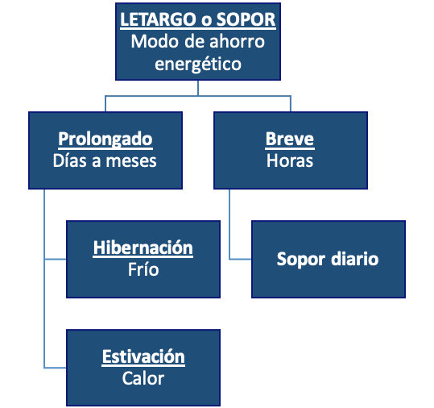
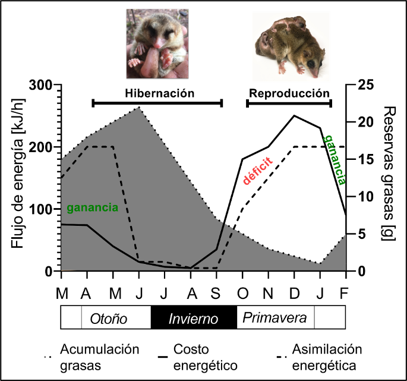
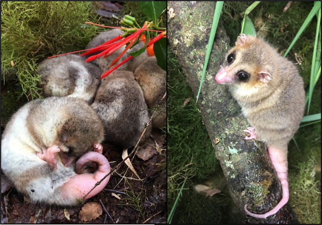
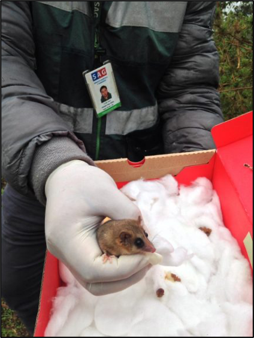
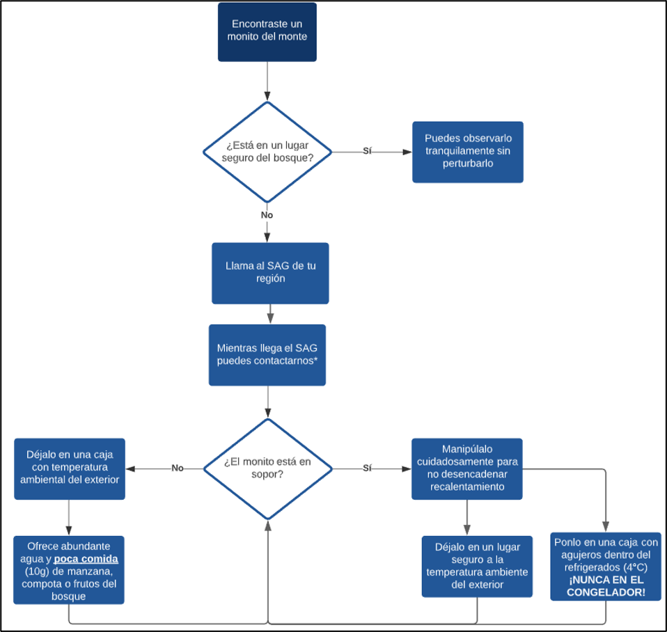

---
authors:
- Carlos Mejías
- admin
categories: []
date: "2021-11-12T00:00:00Z"
image:
  caption: ""
  focal_point: ""
lastMod: "2021-11-12T00:00:00Z"
projects: []
subtitle: 
summary: El monito del monte es un marsupial endémico de los bosques templados del Sur que pasa todo el invierno hibernando, durante este letargo que es mucho más profundo que el sueño, la temperatura corporal puede descender hasta 5°C y los monitos parecieran estar muertos. Debido a esto, las personas cuando los encuentran entre los troncos de árboles piensan que están moribundos y los acercan al calor y alimentan, provocando un estrés térmico y desbalances fisiológicos que pueden acabar con la vida del animal en un par de semanas.
tags: []
title: "EL MONITO DEL MONTE: UN CAMPEÓN DEL AHORRO ENERGÉTICO"
---

Al igual que nuestros teléfonos celulares, algunos animales tienen la capacidad de activar un modo de ahorro energético. Este modo se denomina “sopor” o “letargo” y corresponde a una disminución controlada y reversible del metabolismo y la temperatura corporal, cuyo ahorro energético les permite enfrentar condiciones desfavorables como escasez de alimento o temperaturas ambientales extremas. 

**Figura 1**. Clasificación del letargo o sopor según su duración y estacionalidad

En los mamíferos se han descrito dos tipos de letargo, el letargo de larga duración y de corta duración. El letargo de larga duración, corresponde a un modo de ahorro que puede prolongarse desde varios días hasta algunos meses y suele presentarse de manera estacional; por ejemplo, en invierno el oso negro americano (Ursus americanus) exhibe un letargo prolongado denominado hibernación, mientras que en las épocas cálidas algunas especies de murciélagos y pequeños reptiles tropicales experimentan un letargo llamado estivación. Por otra parte, el letargo de corta duración se denomina sopor diario y suele durar sólo algunas horas, como el que experimenta la yaca (Thylamys elegans), un marsupial didélfido de Chile central y el Picaflor chico (Sephanoides sphaniodes) un ave troquílida del centro-sur de Chile. Sin embargo, en el bosque valdiviano habita el único mamífero sudamericano capaz de experimentar letargo tanto de corta como de larga duración: El monito del monte. 

**Figura 2**. Representación gráfica del presupuesto energético del monito del monte a lo largo del año en relación al flujo de energía y reservas grasas.

El monito del monte (Dromiciops bozinovici y D. gliroides) se distribuye desde los Andes de la Región del Maule hasta Futaleufú, pudiendo ser encontrado en remanentes de bosques costeros hasta los 1600 metros de altura, reflejando su enorme capacidad de adaptación a diversas condiciones climáticas y estacionales.   Además, este mamífero es considerado un “fósil viviente” ya que es el último representante vivo del orden Microbiotheria, grupo que dio origen a los marsupiales australianos, por lo que este monito se encuentra más emparentado con los canguros y koalas que con los otros marsupiales americanos, lo que lo transforma en una pieza clave en la investigación de la evolución de este grupo de mamíferos. 
En la Universidad Austral de Chile (UACh) se está estudiando el uso de las reservas energéticas de este marsupial hibernante, con la intención de determinar cómo el monito enfrentará el cambio climático, dado que necesita una cierta cantidad de días de frío para poder sobrevivir. Para esto, en el Instituto de Ciencias Ambientales y Evolutivas, el equipo del Dr. Roberto Nespolo ha logrado seguir una población de monitos durante la hibernación y ha determinado que estos marsupiales gastan 7 kilojoules diarios, comparado a los 88 kilojoules de su gasto habitual, entre primavera y verano, periodo en el cual se encuentran en actividad. También ha logrado medir la expresión de genes de la hibernación y cómo varía la composición corporal de los monitos durante el año.
En relación a los resultados obtenidos, sintetizamos la importancia de los modos de ahorro energético experimentados por el monito del monte:
La primavera y el verano son claves para la mayoría de los animales de climas templados, porque en esta época comienza a aumentar el alimento disponible y normalmente esto es coincidente con la reproducción, la cual conlleva un importante costo energético y es crucial para la persistencia de las poblaciones. Si bien, el alimento a comienzos de verano es mayor, probablemente aún no alcance para todos, es por esto que en estas fechas los monitos hacen sopor diario a temperaturas mucho más altas que las existentes en invierno (25°C), como una manera facultativa de letargo.  
El monito del monte, comienza la etapa reproductiva en octubre, cuando empieza a formar parejas. Luego de un periodo de gestación muy corto -típico de los mamíferos que carecen de placenta como los marsupiales- los recién nacidos migran desde la cloaca al marsupio a mediados de noviembre. A esto le sigue una lactancia muy larga de unos tres meses, necesaria para que completen su desarrollo. Durante febrero el crecimiento continúa en los nidos, donde los grupos familiares ya realizan excursiones largas al bosque. Posteriormente, en marzo, cuando la disponibilidad de frutos e insectos que sirven como alimento llega a su máximo, las crías de monitos son destetados, lo que permite que las hembras disminuyan el gasto energético relacionado a la lactancia y comiencen a aumentar su peso.
En otoño, los monitos comienzan a aumentar sus reservas grasas de cara al invierno, periodo en el cual la temperatura ambiental decae y existe menor disponibilidad de insectos, pequeños vertebrados y frutos que constituyen su dieta. Algunos investigadores reportan que los animales que experimentan el modo prolongado de ahorro energético, a medida que la época invernal se acerca, realizan eventos de letargo de prueba, como preparación a la hibernación prolongada. En el caso del monito del monte es posible observar que los eventos de sopor diario cada vez se hacen más frecuentes y prolongados, disminuyendo progresivamente su costo energético. 

**Figura 3**. A) Monitos del monte hibernando en grupos, se observa gran cantidad de reservas grasas en la base de la cola. B) Monito del monte activo, también se observa gran cantidad de reservas en la base de la cola.

**Figura 4**. Liberación de monito del monte liderada por el SAG, junio 2020

Entre los meses de junio y septiembre, los monitos del monte llevan a cabo eventos de sopor que pueden durar hasta 9 días, durante los cuales permanecen agrupados dentro de troncos huecos o en nidos esféricos que fabrican principalmente con musgos y hojas de quila. Para entrar en hibernación, los animales comienzan con un sueño que se hace cada vez más profundo, llegando al límite de inhibir la actividad cerebral casi por completo, tal como si se encontraran bajo anestesia o bajo un coma profundo, pero con la posibilidad de revertirlo cuando sea pertinente.
Durante la hibernación, los monitos experimentan algunos cambios en su organismo, tales como la pérdida de peso, la reducción de las reservas grasas, disminución del tejido muscular producida por la inactividad y reducción de su intestino como consecuencia del ayuno prolongado que existe durante este modo de ahorro energético. Todos estos cambios ocurren estacionalmente y son capaces de revertirlos lenta y naturalmente durante el comienzo de la primavera, cuando la temperatura ambiental aumenta junto a la disponibilidad de alimentos y con ello el tiempo en que estos marsupiales permanecen activos.
Para poder salir del sopor, los monitos del monte desencadenan una fase de recalentamiento, en la cual aumentan su costo energético en 90 veces (9000%) por medio de escalofríos que producen un aumento de la temperatura corporal desde un valor similar a la temperatura ambiental, hasta los 35°C típicos de un marsupial en actividad.

Buenas intenciones que matan, el manejo incorrecto de un monito hibernante
Como los monitos del monte parecen moribundos cuando están hibernando o en recalentamiento, es muy común que las personas los recojan de su hábitat –en cortes de leña o árboles caídos- y los lleven a sus hogares para recuperarlos. El problema es que estos individuos no poseen la cantidad de mucosa intestinal necesaria para iniciar la alimentación y la vida activa de un momento a otro, lo que provoca un estrés térmico y desbalance fisiológico que puede desencadenar la muerte del animal en la mayoría de los casos, al par de semanas.

**Figura 5**. Diagrama de flujo de decisiones para el rescate de monitos del monte encontrados

## **¿Qué se puede hacer? La importancia de la evidencia científica**
 
Tomando consideración de la evidencia científica mencionada, entregamos los siguientes consejos para actuar sin poner en riesgo la vida de este campeón del ahorro energético:
-	Si el monito del monte encontrado se encuentra en un nido o un lugar que parece seguro en el bosque, no lo tomes. Este animal se encuentra en modo de ahorro energético, el cual le permitirá sobrevivir al invierno para poder reproducirse en primavera.

-	Ahora, si el monito que encontraste se encuentra dentro de tu casa, en un lugar donde está expuesto a depredadores o entre la leña para la calefacción, debes llamar al SAG para que lo lleven a un Centro de Rehabilitación para su evaluación. 

-	Mientras llega el SAG, asegúrate de dejar al monito en un lugar seguro y a temperatura ambiente, no lo expongas al calor. Una buena alternativa es dejarlo en una caja dentro del refrigerador -nunca en el congelador- con un pote con agua, mientras llega el SAG, si tienes dudas puedes contactar al Laboratorio de Evolución Experimental de la UACh.

-	Si el animal que encontraste se encuentra activo y fuera de su hábitat, debes llamar al SAG y puedes dejarlo en una caja en un lugar seguro y ofrecerle un poco de comida y agua. Para alimentarlo puedes ofrecerle un trozo de manzana (10 gramos aprox.). Recuerda que entre fines de invierno y comienzo de primavera los monitos no están adaptados para comer grandes cantidades de comida. 

No olvides que está estrictamente prohibida la tenencia de animales silvestres como mascotas.

---
Contacto personal Lab. Evolución Experimental: 
* carlosignacio.mejias@gmail.com / Instagram: @carlosinhacio
* robertonespolorossi@gmail.com
* [Ladera Sur](https://laderasur.com/articulo/el-monito-del-monte-un-campeon-del-ahorro-energetico/)

