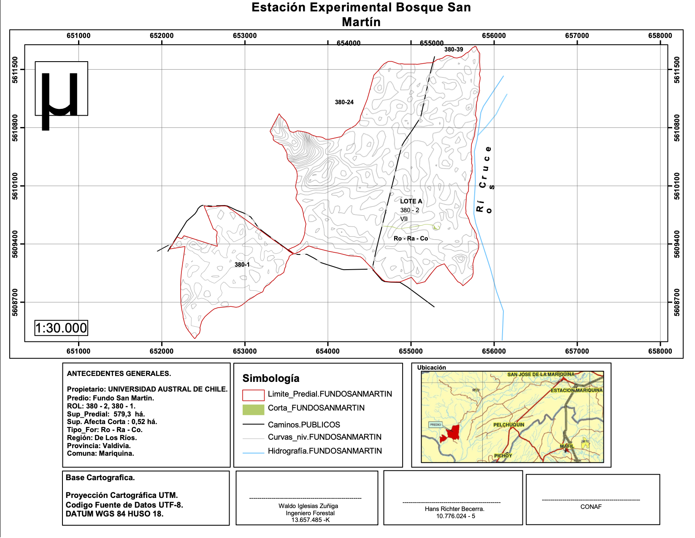
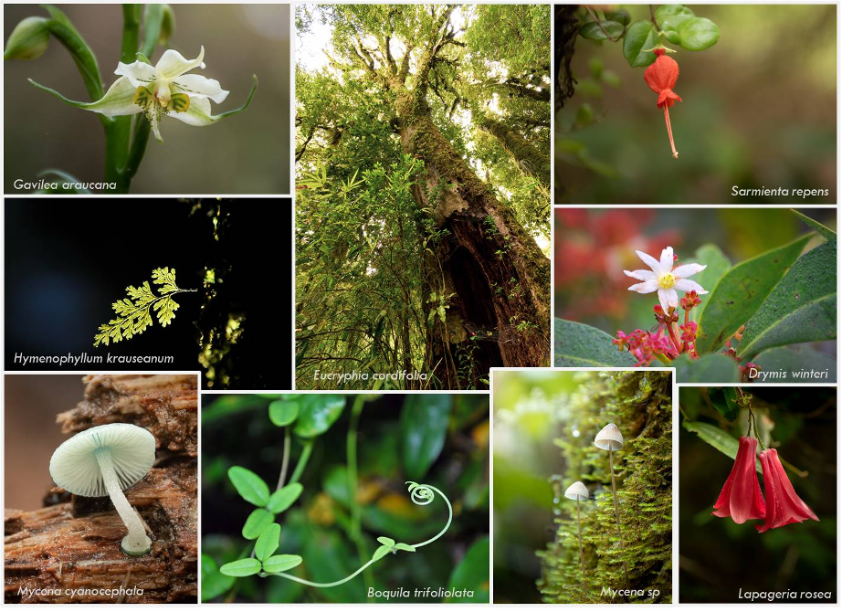
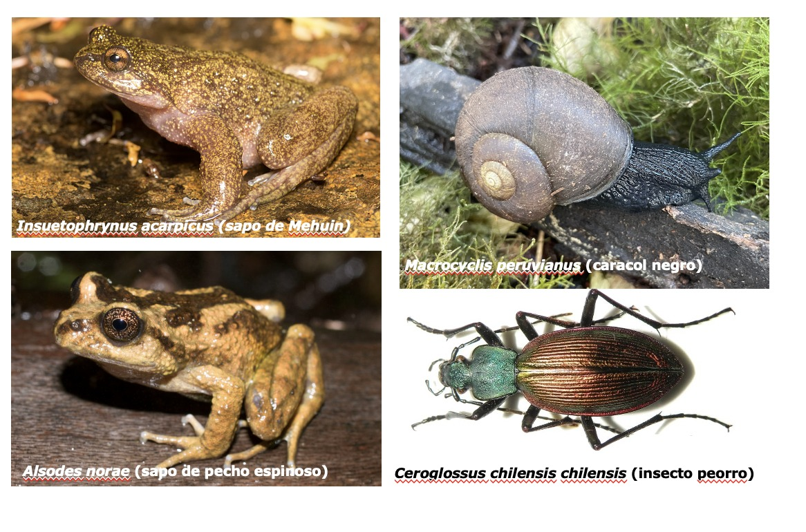
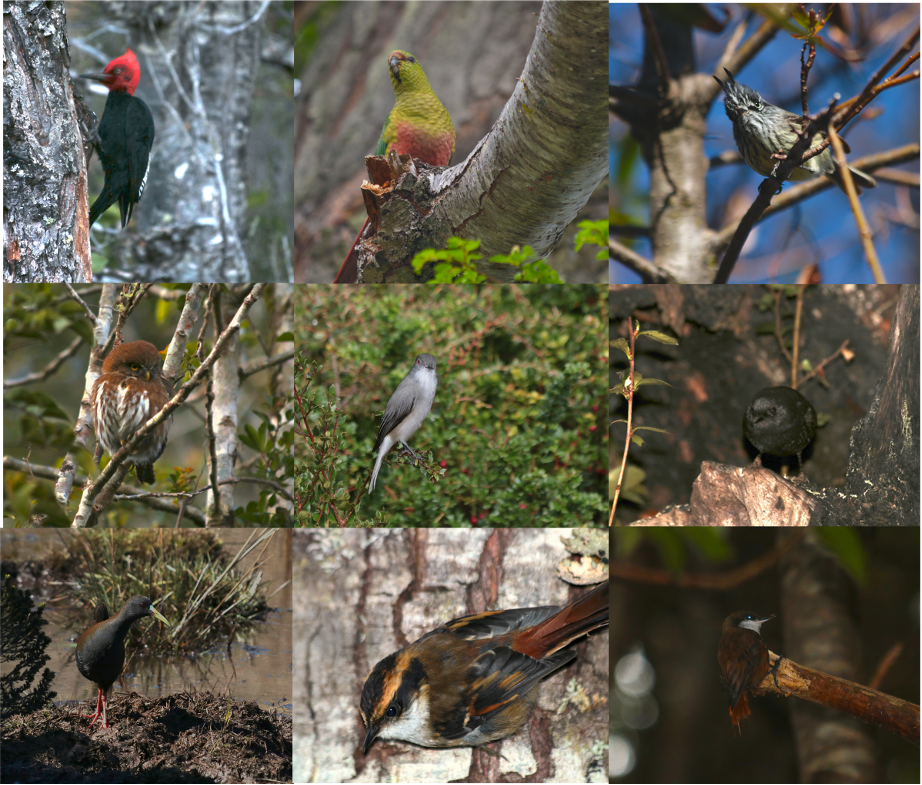
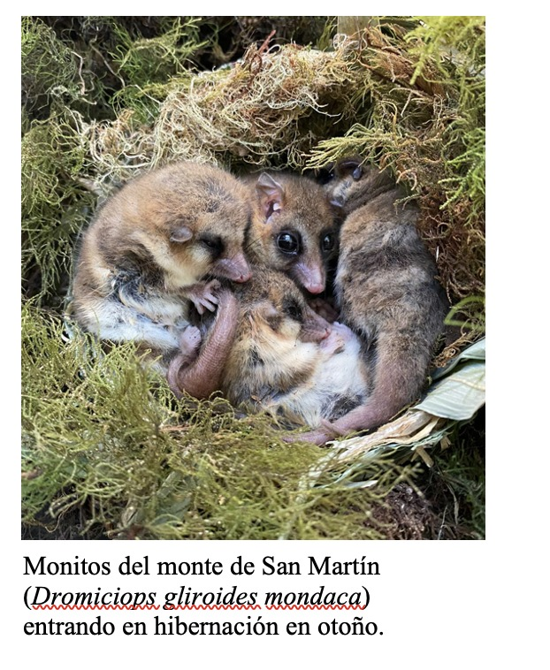

<!--more-->

La Estación Experimental Bosque San Martín (BSM) es un fundo propiedad de la Universidad Austral de Chile, de aproximadamente 300 hectáreas, ubicado en las cercanías de San José de la Mariquina, a una hora veinte minutos de Valdivia por carretera. Fue donado en 1973 a la Universidad para su conservación biológica, y administrado desde entonces por el [Instituto de Ciencias Ambientales y Evolutivas](http://icaev.cl/) de la [Facultad de Ciencias, UACh](http://sitiosciencias.uach.cl/). 

BSM está compuesto por bosque templado-lluvioso en excelente estado de conservación, y se ubica a orillas del Santuario de la Naturaleza Carlos Anwandter, entre San José de la Mariquina y Pilolcura (sector Iñipulli). Dado que la mayoría de los sectores destinados a conservación biológica en Chile son montañosos (pues por su plusvalía, los sectores planos han sido destinados a agricultura o vivienda), no existe otro parche de bosque costero con el estado de conservación de BSM en Chile. Además, con su ubicación al oeste del Río Cruces, BSM forma parte de lo que se conoce como la Cordillera del Mahuidanche o [Cordillera de Oncol](https://es.wikipedia.org/wiki/Cordillera_del_Mahuidanche). Este macizo costero del nor-oeste de Valdivia está flanqueado por los ríos Calle Calle, Cruces y Mehuin, es una zona única de endemismo de fauna y flora, pues hace unos 13 millones de años era una isla rodeada de mar.

_Mapa de la Estacion Experimental de San Martin_ 

La vegetación de BSM tiene características particulares y está dominada por especies siempreverdes del bosque templado lluviosos como Olivillo (_Aextoxicon puctatum_), Tepa (_Laureliopsis philippiana_), Ulmo (_Eucriphia cordifolia_), Canelo (_Drimys winteri_) y numerosas Mirtaceas (_Amomyrtus luma_, _Luma apiculata_, Amomyrtus meli). Pero además, es abundante la especie caducifolia Roble (_Nothofagus oblicua_), formando uno de los remanentes mejor conservados en la distribución sur de esta especie, con ejemplares de más de 35 metros de altura y cerca de un metro y medio de diámetro. El bosque siempreverde prospera en lugares más altos, mientras que el de mirtáceas lo hace en depresiones cercanas al humedal del Río Cruces. En toda su extensión destaca la abundancia de plantas trepadoras como Canelilla (_Hydrangea serratifolia_), Voqui colorado (_Cissus striata_), Pilpilvoqui (_Campsidium valdivianum_), Medallita (_Sarmienta rapens_) Copihue (_Lapageria rosea_) y Botellita (_Mitraria coccinea_)(

_Flora y hongos representativos de BSM. Fuente: Mylthon Jimenez_

La fauna de BSM posee especies emblemáticas tales como el Pudú (_Pudu puda_), la subespecie de San Martín del monito del monte (_Dromiciops gliroides mondaca_), el Zorro Gris (_Pseudalopex griseus_), Zorro culpeo (_Lycalopex culpeaus_), la Guiña (_Leopardus guigna_) y el Puma (_Puma concolor_). Aves como el Carpintero negro (_Campephilus magellanicus_), Cachañas (_Enicognathus ferrugineus_), Torcazas (_Columba araucana_) y Picaflores (_Sephanoides sephaniodes_). Anfibios endémicos como la Ranita de Hojarasca (_Eusophus roseus_), sapo espinoso de Oncol (_Alsodes norae_) y el sapo de Mehuin (_Insuetophrynus acarpicus_),  y moluscos sumamente raros como el Caracol Negro Gigante (_Macrocyclis peruvianus_), entre otras especies animales.

_Anfibios e invertebrados_

#    **Mision**

La Estación Experimental Bosque San Martin (BSM) tiene como misión el estudio científico de los ecosistemas templados del sur de Chile (Bosque, humedal) y la formación de capital humano avanzado en el ámbito de las ciencias naturales, transformándose en una Estación Biológica de Referencia Internacional. Para ello, BSM promoverá el desarrollo de experimentos de largo plazo en temas prioritarios para la sociedad actual, tales como cambio climático, conservación, restauración, manejo y rehabilitación de fauna silvestre. BSM promoverá la formación de científicos de nivel pre- y posgrado, realizando cursos regulares para estudiantes de la Universidad Austral de Chile, así como cursos internacionales de
especialidad. BSM promoverá también actividades de educación ambiental a nivel comunitario y universitario, el mantenimiento de repositorios de biodiversidad y recursos genéticos. En todos estos ámbitos de acción, BSM incorporará la dimensión socioecológica del desarrollo sustentable, haciendo eco del lema UACh “Conocimiento y Naturaleza”, y transformando a nuestra casa de estudios en un referente internacional en estudios de ecología y conservación de los ecosistemas templados.

_Aves representativas de BSM. Fuente_: Mauricio Soto.(De arriba izquierda a derecha:
_Campephilus magellanicus_, _Enicognathus ferrugineus_, _Anairetes parulus_,_Glaucidium nana_,
_Xolmis pyrope_, _Scytalopus magellanicus_, _Pardirallus sanguinolentus_, _Aphrastura spinicauda_, _Pygarrhichas albogularis_)

#   **Visión**

BSM será una estación de investigación científica y al mismo tiempo una Reserva de la Biósfera. BSM administrará sus sistemas naturales implementando senderos interpretativos, señalética para la identificación de especies, medios de fiscalización, y establecerá áreas de
uso diferencial con fines de educación, investigación y conservación de la biodiversidad. Como estación científica, poseerá laboratorios equipados, estaciones meteorológicas, conectividad satelital e instalaciones de monitoreo ambiental (ejemplo: CO2 atmosférico),
además de salas de reuniones e instalaciones para pernoctar.

_Dromiciops gliroides mondaca_

---
Contacto Estación Experimental Bosque San Martin (BSM)

**Roberto Nespolo**

- Director Estación Experimental Bosque San Martín. 
- Proyecto de Levaduras Silvestres para cervecería artesanal en Los Ríos
- Universidad Austral de Chile
- robertonespolorossi@gmail.com