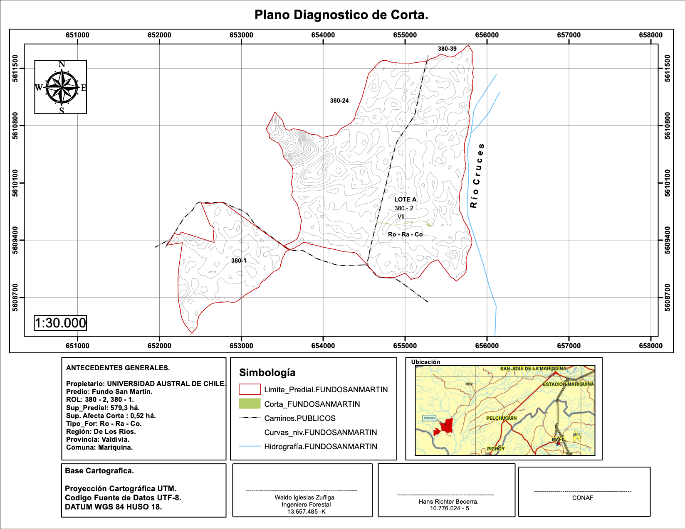

<!--more-->

La Estación Experimental Bosque San Martin (BSM), es una reserva biológica perteneciente a la Universidad Austral de Chile, y administrada por el Instituto de Ciencias Ambientales y Evolutivas (ICAEV) de la Facultad de Ciencias. A poco más de una hora del Campus Teja (78 kilómetros por carretera), BSM ofrece capacidades inigualables para realizar docencia e investigación en vida silvestre, siendo probablemente una de las estaciones de campo más antiguas del país. El área administrada por el ICAEV (unas 300 Há) corresponde a una reserva de bosque templado-lluvioso costero, el que se mantiene intacto desde que fuese donado a la Universidad por Don Adolfo Woerner a comienzos de la década del 70, con fines
de conservación. Este tipo de bosques son muy escazos pues la mayoría fue reemplazado por plantaciones forestales o praderas ganaderas, al no estar dentro del sistema de áreas silvestres protegidas, las cuales se concentran en áreas cordilleranas. BSM, desde su donación, ha
estado bajo la tutela del ICAEV (antes Instituto de Ecología y Evolución), unidad académica que ha administrado su protección y estudio científico. La vegetación de BSM alberga una altísima diversidad biológica, que además por colindar con el humedal Río Cruces, permite
desarrollar investigación asociada a ecosistemas acuáticos continentales, incluyendo también amplias zonas de bosque pantanoso de alto valor de conservación. Sus características como relicto de bosque, su biodiversidad y el alto grado de endemismo de muchas de sus especies,
unido a la cercanía a Valdivia hacen de BSM un enclave con características únicas para la investigación, docencia y educación ambiental, además de representar un patrimonio invaluable como reserva de la biósfera y sumidero de carbono.

_Mapa de la Estacion Experimental de San Martin_ 

#    Mision 

a Estación Experimental Bosque San Martin (BSM) tiene como misión el estudio científico de los ecosistemas templados del sur de Chile (Bosque, humedal) y la formación de capital humano avanzado en el ámbito de las ciencias naturales, transformándose en una Estación Biológica de Referencia Internacional. Para ello, BSM promoverá el desarrollo de experimentos de largo plazo en temas prioritarios para la sociedad actual, tales como cambio climático, conservación, restauración, manejo y rehabilitación de fauna silvestre. BSM promoverá la formación de científicos de nivel pre- y posgrado, realizando cursos regulares para estudiantes de la Universidad Austral de Chile, así como cursos internacionales de
especialidad. BSM promoverá también actividades de educación ambiental a nivel comunitario y universitario, el mantenimiento de repositorios de biodiversidad y recursos genéticos. En todos estos ámbitos de acción, BSM incorporará la dimensión socioecológica del desarrollo sustentable, haciendo eco del lema UACh “Conocimiento y Naturaleza”, y transformando a nuestra casa de estudios en un referente internacional en estudios de ecología y conservación de los ecosistemas templados.

_Aves representativas de BSM. Fuente_: Mauricio Soto.(De arriba izquierda a derecha:
_Campephilus magellanicus_, _Enicognathus ferrugineus_, _Anairetes parulus_,_Glaucidium nana_,
_Xolmis pyrope_, _Scytalopus magellanicus_, _Pardirallus sanguinolentus_, _Aphrastura spinicauda_, _Pygarrhichas albogularis_)

#   Visión

BSM será una estación de investigación científica y al mismo tiempo una Reserva de la Biósfera. BSM administrará sus sistemas naturales implementando senderos interpretativos, señalética para la identificación de especies, medios de fiscalización, y establecerá áreas de
uso diferencial con fines de educación, investigación y conservación de la biodiversidad. Como estación científica, poseerá laboratorios equipados, estaciones meteorológicas, conectividad satelital e instalaciones de monitoreo ambiental (ejemplo: CO2 atmosférico),
además de salas de reuniones e instalaciones para pernoctar.

_Flora y hongos representativos de BSM. Fuente: Mylthon Jimenez_

---
Contacto Estación Experimental Bosque San Martin (BSM)
* Roberto Nespolo: robertonespolorossi@gmail.com