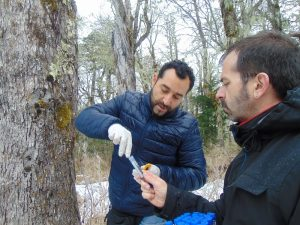
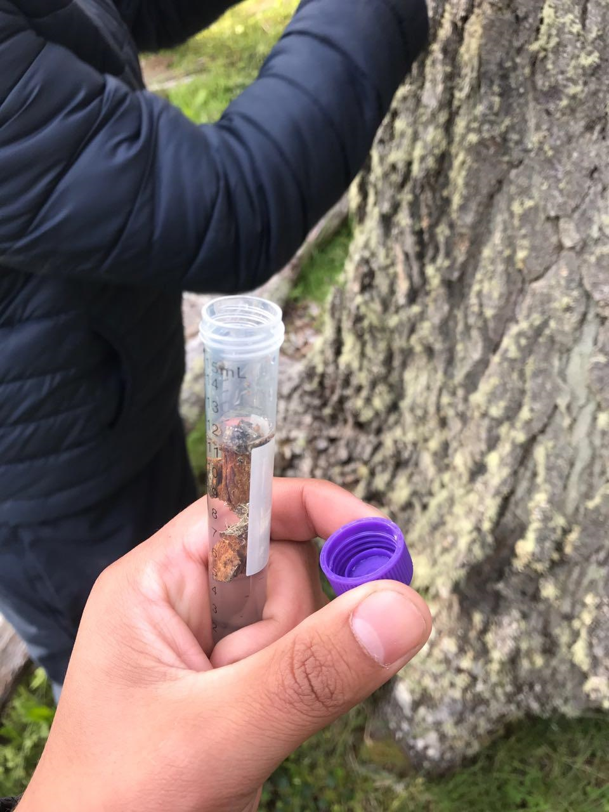
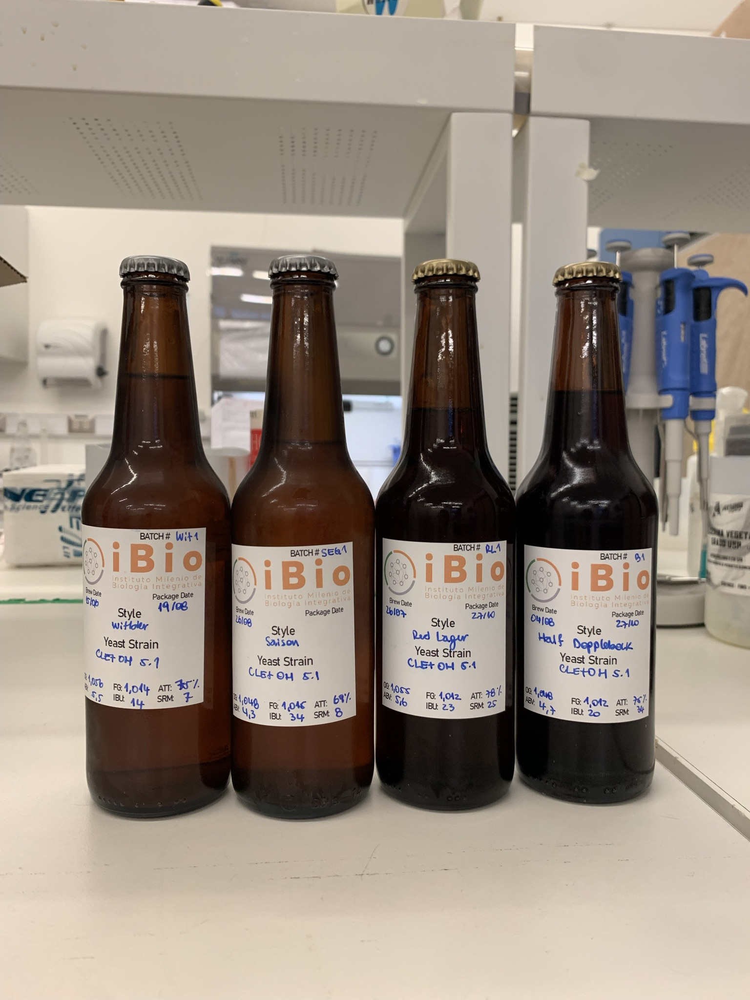
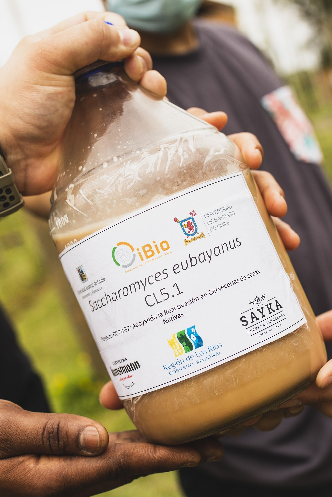
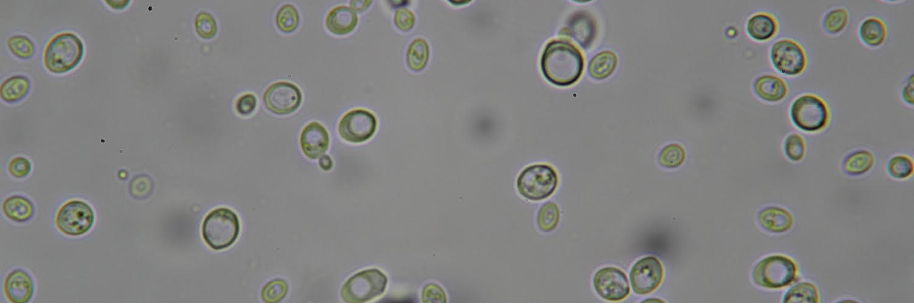
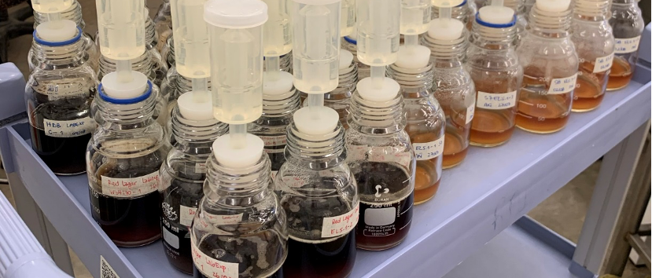
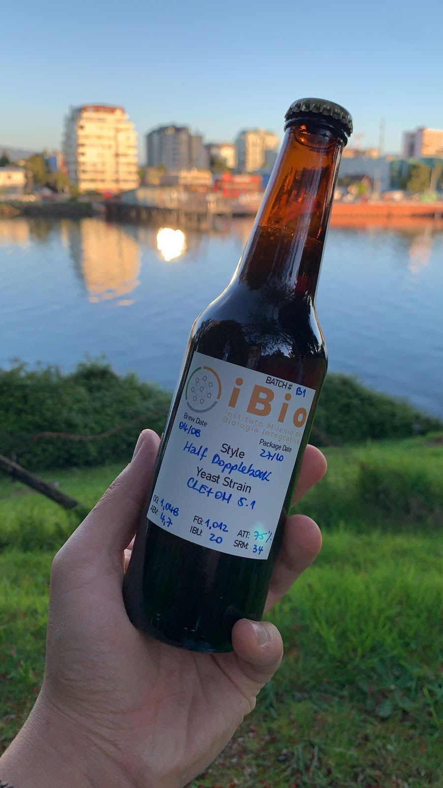

<!--more-->

El interés en la utilización comercial de levaduras nativas nace con el hallazgo de la población con mayor diversidad genética de *Saccharomyces eubayanus* del mundo, ubicada en los bosques patagónicos y sub-patagónicos Chilenos (Eizaguirre et al., 2018; Nespolo et al., 2020). Esta levadura, aislada por primera vez en la Patagonia Argentina, es el ancestro de *Saccharomyces pastorianus*, levadura híbrida utilizada en todo el mundo para la elaboración de cerveza lager desde el siglo XV (Libkind et al., 2011). *S. eubayanus* puede fermentar a bajas temperaturas (9 -- 15°C) a diferencia de Saccharomyces cerevisiae (18 -- 22°C) y por consecuencia, permite la elaboración de cerveza en estaciones frías, hito que sentó las bases para su producción moderna. Actualmente, la cerveza Lager, que se elabora con S. pastorianus representa el 96% del mercado mundial y proviene únicamente de 2 linajes de híbridos interespecíficos. Estos, al no reproducirse de forma sexual limitan la diversidad de sabores y aromas que se pueden obtener en este tipo de cervezas (Gibson & Liti, 2015). Gracias a su reproducción sexual, se generó una gran diversidad genética de S. eubayanus en su territorio nativo, lo cual lo sitúa como un microorganismo de alto interés científico y en la industria de los fermentados, particularmente para diversificar la experiencia sensorial en cervezas de fermentación a baja temperatura.

*Dr Francisco Cubillos & Dr Roberto Nespolo*

{width="362"}

Así, en 2017 un grupo de jóvenes investigadores de la Universidad de Santiago de Chile y de la Universidad Austral de Chile, colectaron muestras de corteza y suelo de árboles del género Nothofagus en variadas latitudes del territorio nacional, desde la Reserva Nacional Altos de Lircay en la Región de Maule hasta el Parque Natural Karukinka en la Isla de Tierra del Fuego, Región de Magallanes, para luego evaluar su desempeño en la fermentación de mostos de cerveza, vino e hidromiel (Mardones et al., 2020; Nespolo et al., 2020). Los aislados con mejor rendimiento se evolucionaron experimentalmente a través de selección artificial y se obtuvo cepas estables con características de interés comercial, con aromas y sabores palatables y atractivos, demostrando así, su potencial en la diversificación de la industria cervecera (Urbina et al., 2020).

{width="294"}

De esta forma, se desarrolló ***S. eubayanus CL5.1***, la primera cepa nativa validada comercialmente en la Región de Los Ríos, la cual fue aislada desde el Parque Nacional Villarrica, comuna de Panguipulli, que confiere a la cerveza un carácter fenólico, con notas agradables a pimienta de Jamaica y clavo de olor (Mardones et al., 2021).

{width="263"}

Además de desarrollar una cerveza nativa, este proyecto desea vincular de forma directa a la academia y sus tecnologías para el análisis con la industria local, y mejorar los estándares de calidad y la forma en que hacemos cerveza, en búsqueda de un reconocimiento nacional e internacional.

{width="293"}

#  **Mision**

Elaborar productos de calidad en base a nuestra biodiversidad microbiana, potenciando fermentados de origen local ideados para destacar en la región. Como Laboratorio de Innovación Cervecera Austral ("**LIC-Austral**") nuestra misión es:

<h1>

Valorizar nuestro patrimonio microbiológico mediante su uso biotecnológico

</h1>

#  **Visión**

Ser un referente nacional e internacional en la investigación y desarrollo de nuevos fermentados en base a la bioprospección de microorganismos nativos en territorio chileno, con miras al desarrollo de productos de calidad con denominación de origen. Buscamos:

<h1>

Posicionar a Chile en el mapa de la innovación fermentativa

</h1>

#  **Valores**

El eje principal de nuestro trabajo está en la vinculación de la academia y el conocimiento científico con las comunidades locales y la industria nacional. Nuestros valores corporativos son:

<h1>

Compromiso con nuestra biodiversidad, la innovación biotecnológica y vinculación con el medio

</h1>

{width="275"}

## **Referencias**

-   Eizaguirre, J. I., Peris, D., Rodríguez, M. E., Lopes, C. A., De Los Ríos, P., Hittinger, C. T., & Libkind, D. (2018). Phylogeography of the wild Lager-brewing ancestor (Saccharomyces eubayanus) in Patagonia. Environmental Microbiology, 20(10), 3732--3743. <https://doi.org/10.1111/1462-2920.14375>
-   Gibson, B., & Liti, G. (2015). Saccharomyces pastorianus: genomic insights inspiring innovation for industry. Yeast, 32(1), 17--27. <https://doi.org/10.1002/YEA.3033>
-   Libkind, D., Hittinger, C. T., Valeŕio, E., Gonca̧lves, C., Dover, J., Johnston, M., ... Sampaio, J. P. (2011). Microbe domestication and the identification of the wild genetic stock of lager-brewing yeast. Proceedings of the National Academy of Sciences of the United States of America, 108(35), 14539--14544. <https://doi.org/10.1073/PNAS.1105430108/-/DCSUPPLEMENTAL>
-   Mardones, W., Villarroel, C. A., Abarca, V., Urbina, K., Peña, T. A., Molinet, J., ... Cubillos, F. A. (2021). Rapid selection response to ethanol in Saccharomyces eubayanus emulates the domestication process under brewing conditions. Microbial Biotechnology. <https://doi.org/10.1111/1751-7915.13803>
-   Mardones, W., Villarroel, C. A., Krogerus, K., Tapia, S. M., Urbina, K., Oporto, C. I., ... Cubillos, F. A. (2020). Molecular profiling of beer wort fermentation diversity across natural Saccharomyces eubayanus isolates. Microbial Biotechnology, 13(4), 1012--1025. <https://doi.org/10.1111/1751-7915.13545>
-   **Nespolo, R. F.**, Villarroel, C. A., Oporto, C. I., Tapia, S. M., Vega-Macaya, F., Urbina, K., ... Cubillos, F. A. (2020). An Out-of-Patagonia migration explains the worldwide diversity and distribution of Saccharomyces eubayanus lineages. PLoS Genetics, 16(5), 1--23. <https://doi.org/10.1371/journal.pgen.1008777>
-   Urbina, K., Villarreal, P., **Nespolo, R. F.**, Salazar, R., Santander, R., & Cubillos, F. A. (2020). Volatile compound screening using HS-SPME-GC/MS on saccharomyces eubayanus strains under low-temperature pilsner wort fermentation. Microorganisms, 8(5), 1--19. <https://doi.org/10.3390/microorganisms8050755>

------------------------------------------------------------------------

#  **Roberto Nespolo**

-   Director Estación Experimental Bosque San Martín.
-   Director proyecto [LILI](https://nucleolili.cl/)
-   Proyecto de Levaduras nativas para cervecería artesanal en Los Ríos
-   Universidad Austral de Chile
-   [robertonespolorossi\@gmail.com](mailto:robertonespolorossi@gmail.com){.email}
